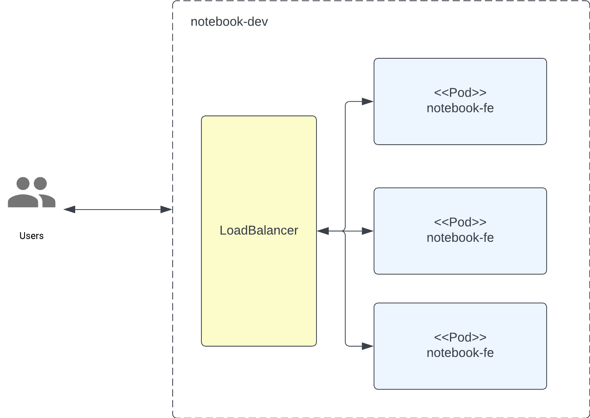

# Assignment

/control-plane-be - backend for control plane
/control-plane-fe - control plane SPA
/iac - terraform scripts for kubernetes infrastructure
/kubernetes - kubernetes manifests notebook application
/notebook-fe - notebook SPA

Notebook application is a simple SPA that allows to insert Javascript code, evaluate it and see the result, written in React. 

Control plane is a simple SPA that allows to create notebook instances, written in React. Backend for control plane is written with ExpressJS. While backend is functional, frontend is not fully implemented - mainly communication with backend is missing due to time constrains.

IaC is written with Terraform. It creates a Kubernetes cluster locally with minikube and deploys notebook application to it, together with control plane frontend and backend. Controlplane backend creates, deletes and lists notebook instances based on provided templates.

Kubernetes manifests are written with Kustomize. They deploy notebook application to the cluster.

### Base Kubrenetes Architecture

### Seting up kubernetes locally

1. Install kubectl
2. Install minikube
3. Start minikube
4. Install kustomize
5. Run kubectl apply -k ./kubernetes/